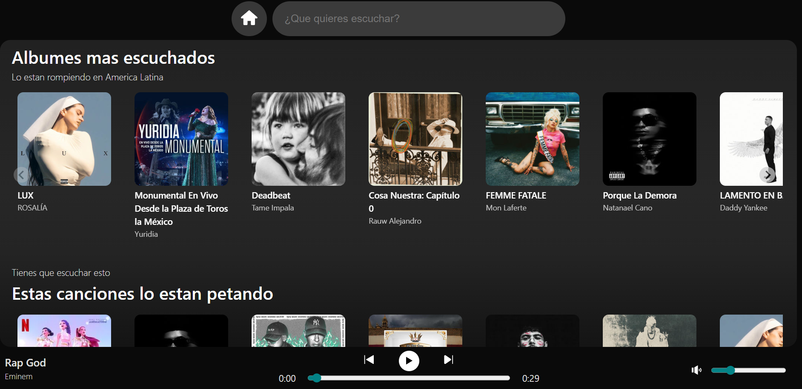

# MusicAppReact

Aplicación web React + TypeScript que muestra álbumes, canciones y playlists populares de Deezer usando un pequeño proxy Express local para evitar CORS y unificar respuestas. Permite buscar, ver pistas de un álbum o playlist y reproducir previews.

## Capturas

## Tecnologías 🔎
 

 
 
 
 
 
 

## Características 💎
Frontend: React (v19) + TypeScript, Vite  
Backend (proxy): Node + Express (ES modules)  
Fetch: node-fetch en el proxy  
Librerías: @splidejs/react-splide (carrusel),  
Linter / herramientas: ESLint, TypeScript  

## Endpoints utilizados
GET /api/albums
Descripción: devuelve los álbumes más populares.
Ejemplo respuesta: { data: [...] } (cada elemento es un Album)  
GET /api/tracks
Descripción: tracks más escuchados (chart top tracks).
Ejemplo respuesta: { data: [...] } o la estructura que retorne (en el proxy se estandariza a {data: ...} cuando corresponde).  
GET /api/playlists
Descripción: playlists populares (chart top playlists).
Ejemplo respuesta: { data: [...] } (cada elemento es un Playlist)  
GET /api/album/:id/tracks
Descripción: canciones de un álbum por id.
Ejemplo respuesta: { data: [Track, ...] }  
GET /api/playlist/:id/tracks
Descripción: canciones de una playlist por id.
Ejemplo respuesta: { data: [Track, ...] }  
GET /api/search?q=tu+consulta
Descripción: búsqueda en Deezer (tracks/artists/albums según query).
Ejemplo respuesta: { data: [Track, ...] }  

## Instalación 🔧
1-Clonar el proyecto: git clone [https://github.com/TUUSUARIO/NOMBRE_DEL_REPO.git](https://github.com/TUUSUARIO/NOMBRE_DEL_REPO.git)  
Cómo ejecutar (Windows PowerShell)
Requisitos: Node.js (v18+ recomendado), npm
Instalar dependencias:
npm install
Iniciar el proxy (desde la raíz del proyecto):
En una terminal PowerShell:
node server.js
Explicación: el proxy escucha por defecto en http://localhost:3001 y reenvía peticiones a la API de Deezer.
Iniciar la app React (en otra terminal):
npm run dev
Abrir en: http://localhost:5173 (o el puerto que Vite indique)
Build:
npm run build
Versión preview:
npm run preview

## Uso 💡
Página principal muestra:
Carrusel de álbumes populares — clic en una portada carga las pistas del álbum en la vista principal.
Carrusel de canciones top — botones para reproducir preview.
Carrusel de playlists — clic en una portada carga las pistas de la playlist.
Buscador — muestra resultados en el área principal cuando se busca algo.
Reproducción:
La app usa preview (URL preview en Track) para reproducir 30s; la función onPlayTrack en el componente principal maneja la reproducción y onSetPlaylist actualiza la lista de reproducción.

## Demo 📌
[MusicAppReact](https://music-app-react-kohl.vercel.app/)

## Licencia

All Rights Reserved.

## Contacto 🧭​

💻 **Mi perfil de Linkedin:** [Linkedin](https://www.linkedin.com/in/adam-samuel-inzunza-ramirez/) 
🌐 **Mira mi portafolio!** [Portafolio](https://adamramirezdev.github.io/PortafolioFrontend/) 
📩 **Email: [adaminzunza3@gmail.com](mailto:adaminzunza3@gmail.com)**  
📱 **Telefono: 3320664573**
